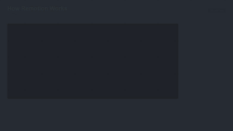

# Claude Code Intro - Remotion Video Project

A programmatic video generation project using Remotion, React, and TypeScript. This project creates animated intro videos for the "Claude Code" tech channel.

## Showcase

### Claude Code Intro


### Data Dashboard
Animated charts with counting numbers and bar graphs


### Kinetic Typography
Quote animation with multiple text effects


### Product Showcase
Feature list with animated checkmarks and progress indicators


### Countdown Timer
3-2-1-GO! with particle explosions and burst effects


### Code Walkthrough
Syntax highlighting with typewriter effect and annotations


---

## What is This Project?

This project lets you create videos using code instead of video editing software. Think of it like programming a movie - you write React components that describe what should appear on screen, and Remotion converts that into a real video file.

**Output Example**: A 7-second animated intro with the "Claude Code" logo, spring animations, glowing effects, and a tech aesthetic.

## Quick Start (5 Minutes)

### Prerequisites

- **Node.js 18 or higher** - [Download here](https://nodejs.org/)
- **A code editor** - VS Code recommended

### Steps

```bash
# 1. Navigate to project folder
cd claude_remotion_me2

# 2. Install dependencies (only needed once)
npm install

# 3. Start the preview studio
npm run dev

# 4. Open browser to http://localhost:3000
```

You'll see Remotion Studio where you can preview and scrub through the video.

### Render the Video

```bash
npx remotion render ClaudeCodeIntro out/claude-code-intro.mp4
```

This creates the final video file in the `out/` folder.

## Documentation

| Document | Description | Audience |
|----------|-------------|----------|
| [Remotion Explained](docs/REMOTION_EXPLAINED.md) | How Remotion & Claude Code skills work | Everyone |
| [Quick Start Guide](docs/QUICK_START.md) | 10 hands-on tutorials | New users |
| [User Guide](docs/USER_GUIDE.md) | Complete usage instructions | All users |
| [Developer Guide](docs/DEVELOPER_GUIDE.md) | Technical deep-dive | Developers |
| [Architecture](docs/ARCHITECTURE.md) | System design & patterns | Developers |
| [Troubleshooting](docs/TROUBLESHOOTING.md) | Common problems & solutions | Everyone |
| [CLAUDE.md](CLAUDE.md) | AI assistant instructions | Claude Code |

## Project Structure

```
claude_remotion_me2/
├── src/                        # Source code
│   ├── index.ts                # Application entry point
│   ├── Root.tsx                # Video composition registry
│   ├── ClaudeCodeIntro.tsx     # Main intro animation
│   ├── DataDashboard.tsx       # Animated data dashboard
│   ├── KineticTypography.tsx   # Quote animation
│   ├── ProductShowcase.tsx     # Feature showcase
│   ├── CountdownTimer.tsx      # Countdown with effects
│   └── CodeWalkthrough.tsx     # Code syntax demo
├── out/                        # Rendered videos (MP4)
├── docs/                       # Documentation
│   └── assets/                 # GIF previews for README
├── scripts/                    # Utility scripts
├── package.json                # Project configuration
├── tsconfig.json               # TypeScript settings
├── remotion.config.ts          # Remotion settings
└── README.md                   # This file
```

## Available Commands

| Command | What it does |
|---------|--------------|
| `npm run dev` | Start Remotion Studio for previewing |
| `npm run build` | Render all videos |
| `npx remotion render ClaudeCodeIntro out/intro.mp4` | Render intro |
| `npx remotion render DataDashboard out/dashboard.mp4` | Render dashboard |
| `npx remotion render KineticTypography out/typography.mp4` | Render typography |
| `npx remotion render ProductShowcase out/showcase.mp4` | Render showcase |
| `npx remotion render CountdownTimer out/countdown.mp4` | Render countdown |
| `npx remotion render CodeWalkthrough out/walkthrough.mp4` | Render walkthrough |

## Video Specifications

| Video | Duration | File Size |
|-------|----------|-----------|
| Claude Code Intro | 7 sec | ~1 MB |
| Data Dashboard | 12 sec | ~1.4 MB |
| Kinetic Typography | 14 sec | ~1.2 MB |
| Product Showcase | 15 sec | ~2.1 MB |
| Countdown Timer | 7 sec | ~1.8 MB |
| Code Walkthrough | 16 sec | ~1.4 MB |

- **Resolution**: 1920×1080 (Full HD)
- **Frame Rate**: 30 fps
- **Format**: MP4 (H.264 codec)

## Technology Stack

| Technology | Purpose | Why We Use It |
|------------|---------|---------------|
| Remotion | Video framework | Creates videos from React code |
| React | UI library | Component-based, declarative |
| TypeScript | Language | Type safety, better tooling |
| Node.js | Runtime | Runs JavaScript outside browser |

## For C/C++/Java Developers

If you're coming from traditional programming:

- **React components** are like classes that render UI
- **JSX** (the HTML-like syntax) compiles to function calls
- **Props** are like constructor parameters
- **Hooks** (`useState`, `useCurrentFrame`) are like instance variables
- **npm** is like Maven/Gradle/CMake for JavaScript

See [Developer Guide](docs/DEVELOPER_GUIDE.md) for detailed explanations.

## Need Help?

1. Check [Troubleshooting Guide](docs/TROUBLESHOOTING.md)
2. Review [Quick Start Guide](docs/QUICK_START.md) for step-by-step tutorials
3. Read [Remotion Documentation](https://www.remotion.dev/docs)

## Acknowledgements

1. This project was developed based on [Complete Guide: How to Setup Remotion Agent Skills with Claude Code (AI Video Generation Tutorial 2026)](https://www.reddit.com/r/MotionDesign/comments/1qkqxwm/complete_guide_how_to_setup_remotion_agent_skills/).

2. All code and documentation were generated by [Claude Code](https://claude.ai/code) powered by Claude Opus 4.5.

## License

ISC License
